# 1. 🗄️ Database System Concepts — สรุปเตรียมสอบ Midterm ฉบับเข้าใจง่าย & ไร้ความซ้ำซ้อน
> **ต้นฉบับ:** Database System Concepts - MID 01/2023 - By P’ Sila (IT20)  
> **ปรับปรุงโดย:** แปลงภาษาให้กระชับ เข้าใจง่าย แก้คำศัพท์แปลผิด ตัดเนื้อหาซ้ำซ้อน พร้อมรูปภาพประกอบและทริคจำสำหรับทำข้อสอบ

---

## 1.1. 📑 สารบัญ
1. [Chapter 01: The Database Approach (แนวคิดและระบบฐานข้อมูล)](#chapter-01-the-database-approach)
2. [Chapter 02: Data Models (แบบจำลองข้อมูล & ระดับการมองข้อมูล)](#chapter-02-data-models)
3. [Chapter 04: Relational Model Characteristics (โครงสร้างตาราง, คีย์ และพีชคณิต)](#chapter-04-relational-model-characteristics)
4. [Chapter 09: Normalizing Database Designs (การทำ Normalization 1NF ถึง 4NF)](#chapter-09-normalizing-database-designs)
5. [📌 สรุปสูตรลัดและจุดที่ข้อสอบชอบหลอก (Cheat Sheet)](#-สรุปสูตรลัดและจุดที่ข้อสอบชอบหลอก)

---

# 2. Chapter 01: The Database Approach


### 2.0.1. 1.1 Data vs Information vs Metadata

| คำศัพท์ | ความหมายเข้าใจง่าย | ตัวอย่างเปรียบเทียบ | ตัวอย่างจริง |
| :--- | :--- | :--- | :--- |
| **Data (ข้อมูลดิบ)** | ข้อเท็จจริงดิบๆ ตัวเลข หรือตัวอักษรที่ยังไม่ผ่านการประมวลผล ไม่มีบริบทในตัวเอง | วัตถุดิบสด เช่น ข้าวสาร, หมูสด | `24`, `0812345678`, `John` |
| **Information (สารสนเทศ)** | ข้อมูลดิบที่ถูกประมวลผล จัดรูปแบบ ตีความ จน **เกิดความหมายและคุณค่า** นำไปใช้ตัดสินใจได้ | อาหารปรุงเสร็จพร้อมทาน | `"อุณหภูมิห้อง 24°C"`, `"ยอดขายเดือนนี้ 24 ล้านบาท"` |
| **Metadata (ข้อมูลอธิบายข้อมูล)** | ข้อมูลที่ใช้อธิบายคุณลักษณะ ชนิด และโครงสร้างของข้อมูลดิบ | ฉลากข้างกล่องอาหาร | `Type: INT, Length: 2, Unit: Celsius` |

> 💡 **ทริคจำ:**  
> **Data** = วัตถุดิบ $\rightarrow$ **ประมวลผล (Process)** $\rightarrow$ **Information** = เมนูอาหารพร้อมทาน  
> **Metadata** = ฉลากบอกสูตรและส่วนผสม

---

### 2.0.2. 1.2 วิวัฒนาการ: จากระบบไฟล์ดั้งเดิม (File System) สู่ระบบฐานข้อมูล (Database)

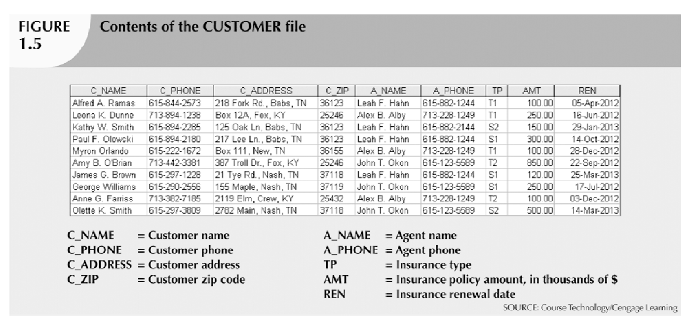

ในอดีตแต่ละโปรแกรมจะสร้างไฟล์เก็บข้อมูลของตัวเอง (File-based System) ทำให้เกิดปัญหาใหญ่ตามมา:

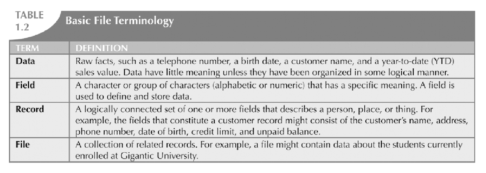

#### 2.0.2.1. ❌ ปัญหาของ File System (ข้อสอบชอบถาม):
1. **Structural Dependence (ขึ้นกับโครงสร้างไฟล์):** ถ้าเปลี่ยนโครงสร้างไฟล์ (เช่น เพิ่มฟิลด์) โปรแกรมที่อ่านไฟล์นั้นจะพังทันที ต้องตามแก้โค้ดทุกโปรแกรม
2. **Data Dependence (ขึ้นกับวิธีเก็บข้อมูล):** เปลี่ยนวิธีจัดเก็บข้อมูลในดิสก์ กระทบโค้ดการเข้าถึงข้อมูล
3. **Islands of Information (เกาะข้อมูลกระจัดกระจาย):** แผนกการเงินมีไฟล์หนึ่ง แผนกบุคคลมีอีกไฟล์ ข้อมูลแยกกัน ไม่เชื่อมโยง
4. **Data Redundancy (ความซ้ำซ้อนของข้อมูล):** ข้อมูลเดียวกันถูกเก็บหลายที่ เปลืองพื้นที่ และเสี่ยงต่อข้อมูลไม่ตรงกัน (Inconsistency)
5. **Data Anomalies (ความผิดปกติเมื่อจัดการข้อมูล):**
   - **Update Anomaly:** แก้นามสกุลลูกค้าที่แผนกหนึ่ง แต่ลืมแก้อีกแผนก ทำให้ข้อมูลขัดแย้งกัน
   - **Insertion Anomaly:** อยากเพิ่มข้อมูลสินค้าใหม่ แต่ยังไม่มีลูกค้าซื้อ เลยบันทึกไม่ได้เพราะไฟล์บังคับผูกกับรหัสลูกค้า
   - **Deletion Anomaly:** ลบข้อมูลการซื้อของลูกค้า ดันเผลอลบประวัติข้อมูลลูกค้าทิ้งไปด้วย
6. **ขาดความยืดหยุ่น (No Ad-Hoc Queries):** อยากได้รายงานพิเศษที ต้องจ้างโปรแกรมเมอร์เขียนโค้ดใหม่เป็นวันๆ

---

### 2.0.3. 1.3 ระบบจัดการฐานข้อมูล (DBMS: Database Management System)

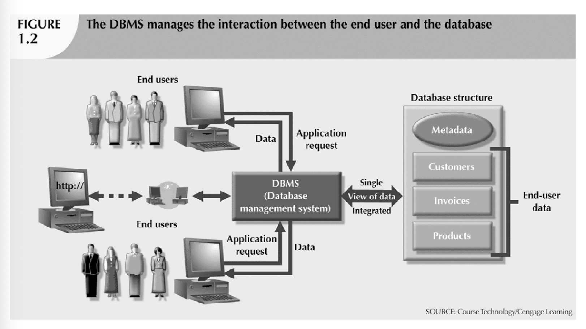

**DBMS คืออะไร?**  
เป็นโปรแกรมคนกลาง (เช่น MySQL, PostgreSQL, Oracle, SQL Server) ที่คั่นกลางระหว่าง **ผู้ใช้/แอปพลิเคชัน** กับ **ไฟล์ข้อมูลจริง** เพื่อจัดการ สร้าง แก้ไข ค้นหา และควบคุมความปลอดภัย

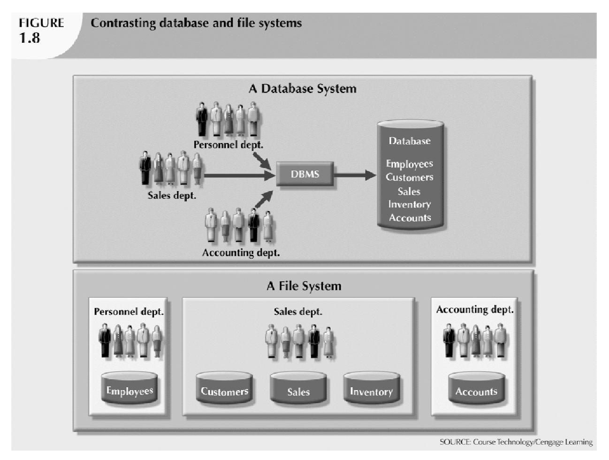

#### 2.0.3.1. 🌟 5 องค์ประกอบของ Database System Environment:
1. **Hardware:** เซิร์ฟเวอร์, คอมพิวเตอร์, Storage (SSD/HDD)
2. **Software:** OS, ตัวโปรแกรม DBMS, Application Program
3. **People (ผู้ใช้งาน):** System Admin, DBA (Database Administrator), Database Designer, Programmer, End User
4. **Data:** ตัวข้อมูลจริง + Metadata
5. **Procedures (ขั้นตอนปฏิบัติงาน):** กฎระเบียบ คู่มือ การสำรองข้อมูล (Backup) และกู้คืนข้อมูล (Recovery)

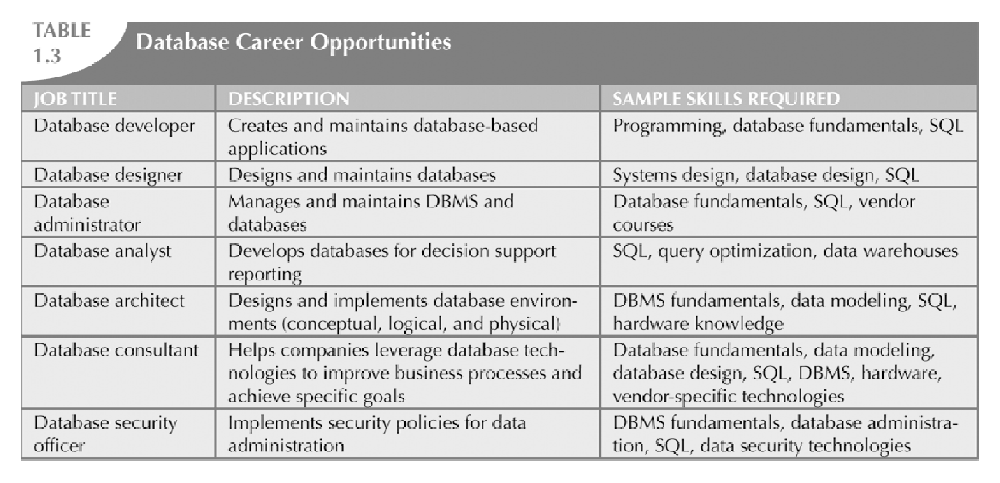

#### 2.0.3.2. 🛠️ หน้าที่สำคัญ 8 ประการของ DBMS:
1. **Data Dictionary Management:** จัดเก็บ Metadata โครงสร้างตาราง ความสัมพันธ์
2. **Data Storage Management:** จัดเก็บข้อมูล โครงสร้างไฟล์ และช่วยบีบอัดข้อมูล
3. **Data Transformation & Presentation:** แปลงข้อมูลให้อยู่ในรูปแบบที่โปรแกรมต้องการ
4. **Security Management:** กำหนดสิทธิ์ผู้ใช้ (User Privileges & Authentication)
5. **Multi-User Access Control:** จัดการให้คนหลายพันคนเข้าถึงข้อมูลพร้อมกันได้โดยข้อมูลไม่พัง (Concurrency Control)
6. **Backup and Recovery Management:** สำรองข้อมูลและกู้คืนเมื่อระบบล่ม
7. **Data Integrity Management:** ตรวจสอบความถูกต้องของข้อมูล (เช่น ห้ามอายุติดลบ, รหัสต้องไม่ซ้ำ)
8. **Database Access Languages & API:** รองรับภาษามาตรฐานอย่าง **SQL** ในการค้นหาและจัดการข้อมูล

---

### 2.0.4. 1.4 การจำแนกประเภทของฐานข้อมูล (Types of Databases)

| เกณฑ์จำแนก | ประเภท | ความหมายและลักษณะเด่น | ตัวอย่างการใช้งาน |
| :--- | :--- | :--- | :--- |
| **ตามจำนวนผู้ใช้** | **Single-User** | ใช้ได้คนเดียวในเวลาหนึ่ง ไม่แชร์ใคร จัดการง่าย | SQLite บนมือถือ, MS Access ส่วนตัว |
| | **Multi-User** | หลายคนใช้งานพร้อมกันได้ แบ่งเป็น Workgroup (<50 คน) หรือ Enterprise (>50 คน) | ระบบ ERP, ระบบธนาคาร |
| **ตามสถานที่ตั้ง** | **Centralized** | เก็บข้อมูลไว้ที่เซิร์ฟเวอร์จุดเดียว ง่ายต่อการดูแล | เซิร์ฟเวอร์หลักของบริษัท |
| | **Distributed** | กระจายข้อมูลเก็บไว้หลายเซิร์ฟเวอร์/หลายสาขา เชื่อมกันผ่านเครือข่าย | Google Cloud Spanner, AWS DynamoDB |
| **ตามลักษณะงาน** | **Operational / OLTP** | เน้นบันทึกธุรกรรมประจำวัน **เร็ว ถูกต้อง Real-time** รายการย่อยๆ จำนวนมาก | ระบบแคชเชียร์ 7-Eleven, ระบบกดเงิน ATM |
| | **Data Warehouse / OLAP** | เน้นเก็บข้อมูลสะสมย้อนหลัง เพื่อ **ดึงไปวิเคราะห์/ทำกราฟ/พยากรณ์ธุรกิจ** ของผู้บริหาร | รายงานสรุปยอดขาย 5 ปีย้อนหลัง, BigQuery |
| **ตามรูปแบบข้อมูล** | **Structured Data** | โครงสร้างชัดเจน เป็นตารางแถว/คอลัมน์ มี Type แน่นอน | ตารางใน SQL Database |
| | **Unstructured Data** | ไร้โครงสร้างแน่นอน ไม่สามารถเก็บในตาราง 2 มิติตรงๆ ได้ | ไฟล์เสียง, รูปภาพ, วิดีโอ, แคปชัน Facebook |

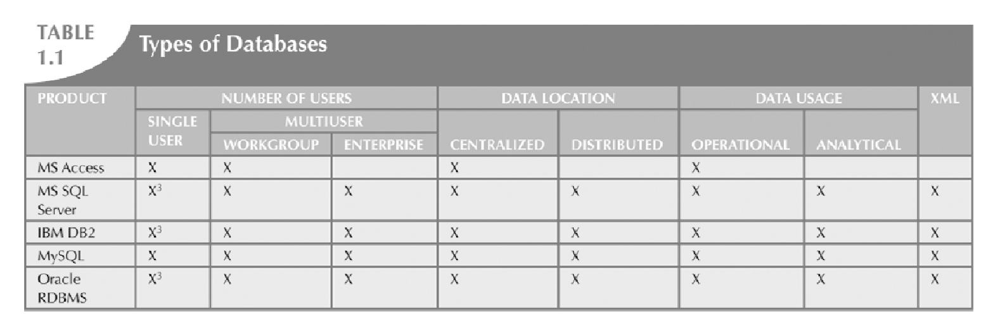

---

# 3. Chapter 02: Data Models

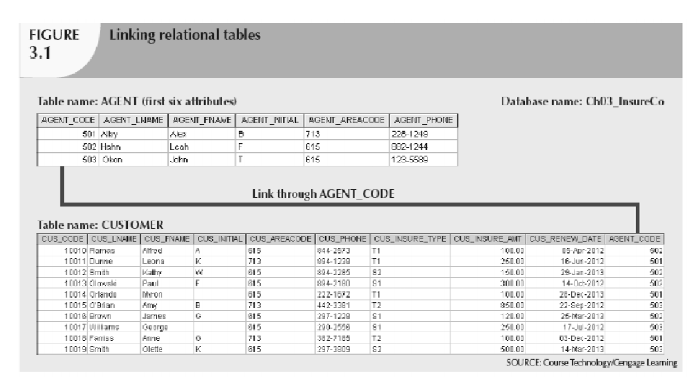

### 3.0.1. 2.1 ส่วนประกอบพื้นฐานของ Data Model (Basic Building Blocks)
Data Model คือ **"พิมพ์เขียว (Blueprint)"** ในการสื่อสารระหว่างผู้ออกแบบ ผู้พัฒนา และผู้ใช้ เพื่อให้เห็นภาพตรงกัน ประกอบด้วย 4 อย่างหลัก:

1. **Entity (เอนทิตี):** สิ่งที่เราสนใจเก็บข้อมูล เปรียบเสมือน **"ตาราง (Table)"** เช่น `Customer`, `Product`, `Order`
2. **Attribute (แอตทริบิวต์):** คุณลักษณะของ Entity เปรียบเสมือน **"คอลัมน์ (Column)"** เช่น รหัสลูกค้า, ชื่อ, เบอร์โทร
3. **Relationship (ความสัมพันธ์):** ความเชื่อมโยงระหว่าง Entity แบ่งออกเป็น 3 แบบ:
   - **1:1 (One-to-One):** 1 คน มี 1 บัตรประชาชน
   - **1:M (One-to-Many):** 1 แผนก มีพนักงานได้หลายคน (พนักงาน 1 คนสังกัดได้แผนกเดียว)
   - **M:N (Many-to-Many):** 1 นักศึกษาลงได้หลายวิชา, 1 วิชา มีนักศึกษาเรียนได้หลายคน
4. **Constraint (ข้อจำกัด):** กฎเกณฑ์ที่ข้อมูลต้องปฏิบัติตาม เช่น เกรดเฉลี่ยต้องอยู่ระหว่าง `0.00 - 4.00`, วันเดือนปีเกิดห้ามเป็นอนาคต

> 📌 **Business Rules (กฎทางธุรกิจ):** คือข้อกำหนดจากนโยบายองค์กรที่ใช้กำหนดทิศทางในการออกแบบฐานข้อมูล เช่น *"ลูกค้า 1 คน สามารถเปิดบัญชีได้ไม่จำกัด แต่ละบัญชีต้องมีเจ้าของอย่างน้อย 1 คน"* $\rightarrow$ นำมาวาดเป็น Entity, Relationship และ Constraint

---

### 3.0.2. 2.2 วิวัฒนาการของแบบจำลองข้อมูล (Evolution of Data Models)

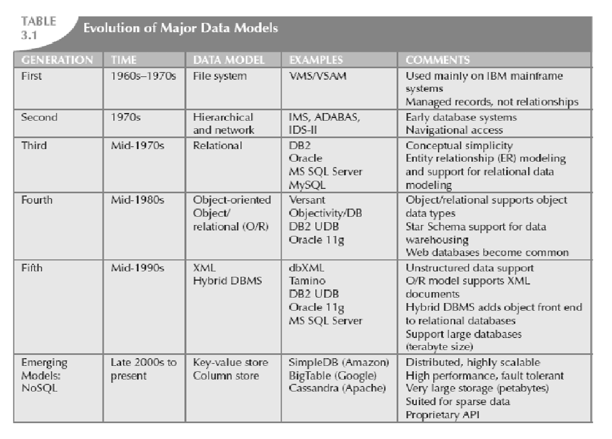

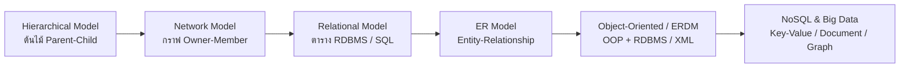
```mermaid
graph LR
    A[Hierarchical Model<br/>ต้นไม้ Parent-Child] --> B[Network Model<br/>กราฟ Owner-Member]
    B --> C[Relational Model<br/>ตาราง RDBMS / SQL]
    C --> D[ER Model<br/>Entity-Relationship]
    D --> E[Object-Oriented / ERDM<br/>OOP + RDBMS / XML]
    E --> F[NoSQL & Big Data<br/>Key-Value / Document / Graph]
```

1. **Hierarchical Model (แบบต้นไม้):**
   - เก็บแบบ พ่อ-ลูก (Parent-Child 1:M) ลูก 1 ตัวมีพ่อได้ตัวเดียวเท่านั้น โครงสร้างแข็งทื่อ แก้ไขยาก
2. **Network Model (แบบร่างแห/เครือข่าย):**
   - พัฒนาต่อจาก Hierarchical โดยอนุญาตให้ลูกมีพ่อได้หลายคน (Owner-Member)
   - เป็นจุดเริ่มต้นของคำว่า **Schema** (โครงสร้างทั้งหมด), **Subschema** (มุมมองของผู้ใช้), **DDL** (ภาษาสร้างโครงสร้าง) และ **DML** (ภาษาจัดการข้อมูล)
3. **Relational Model (โมเดลเชิงสัมพันธ์ - ใช้อยู่ในปัจจุบัน):**
   - นำเสนอโดย **E.F. Codd (1970)**
   - เก็บข้อมูลเป็น **ตาราง 2 มิติ (Relations)** เชื่อมความสัมพันธ์ด้วย **Key (PK และ FK)** ซ่อนความซับซ้อนของการจัดเก็บในฮาร์ดแวร์ไว้เบื้องหลัง
4. **Object-Oriented Model (OODBMS):**
   - มองข้อมูลเป็น **Object** รวม Data + Methods เข้าด้วยกันตามหลัก OOP (Encapsulation, Inheritance, Polymorphism)

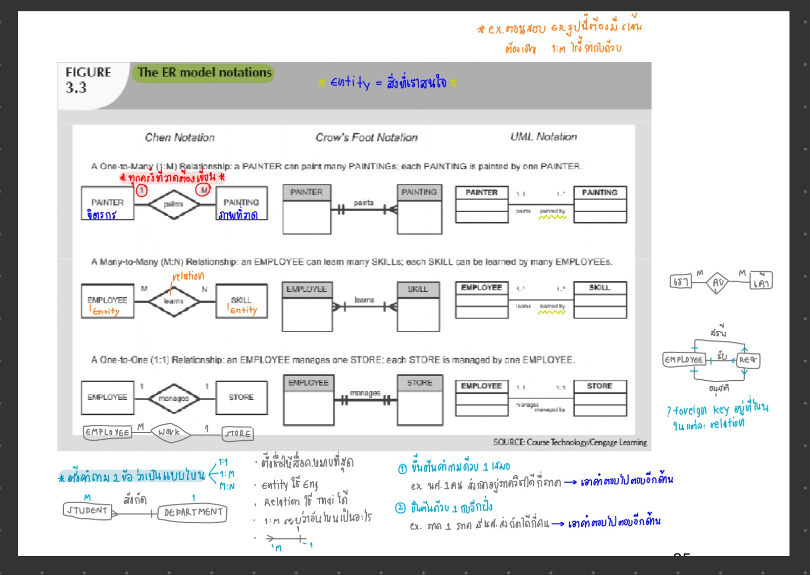

> ⚠️ **จุดแก้คำผิดจากสไลด์เดิม:**  
> ในสไลด์เดิมแปลคำว่า **Polymorphism** ว่า *"การหลีกเลี่ยง"* ซึ่งผิด!  
> **ที่ถูกต้อง:** **Polymorphism** คือ **"การมีได้หลายรูปแบบ (พหุสัณฐาน)"** เช่น คลาสสุนัขและคลาสนกมี Method ชื่อ `move()` เหมือนกัน แต่สุนัขจะวิ่ง ส่วนนกจะบิน

5. **Big Data & NoSQL:**
   - **Big Data 3V:** **Volume** (ปริมาณมหาศาลระดับ Petabyte), **Velocity** (ความเร็วในการเกิดข้อมูลสูงมาก), **Variety** (ความหลากหลายทั้งภาพ เสียง ข้อความ)
   - **NoSQL (Not Only SQL):** ไม่ยึดติดกับโครงสร้างตาราง เช่น **Key-Value** (Redis), **Document** (MongoDB), **Column-Family** (Cassandra), **Graph** (Neo4j)

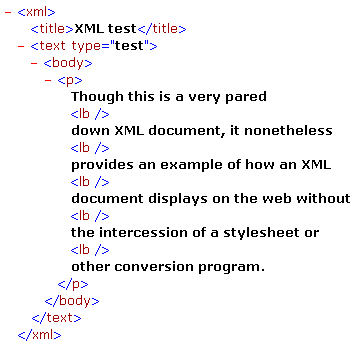

---

### 3.0.3. 2.3 ระดับของการซ่อนรายละเอียดข้อมูล (Degrees of Data Abstraction)

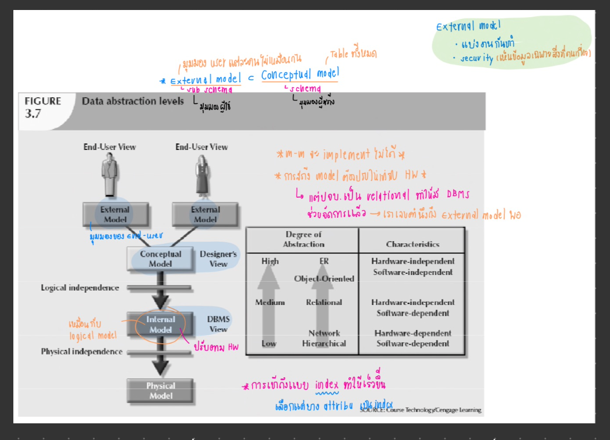

ตามมาตรฐาน ANSI/SPARC สถาปัตยกรรมฐานข้อมูลแบ่งออกเป็น 4 ระดับ (มองจากระดับสูงสุดลงไปหาระดับต่ำสุด):

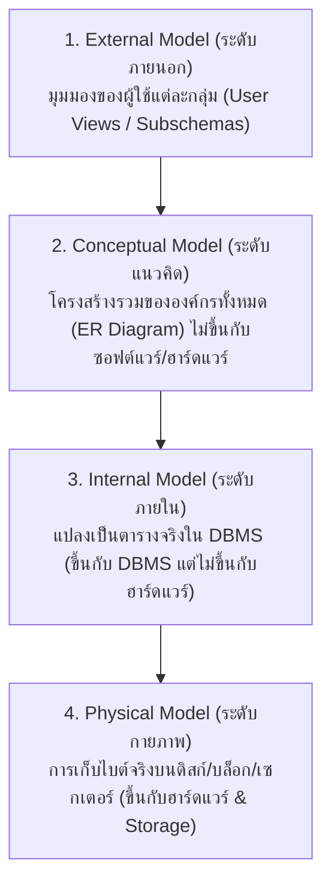
```mermaid
graph TD
    A["1. External Model (ระดับภายนอก)<br/>มุมมองของผู้ใช้แต่ละกลุ่ม (User Views / Subschemas)"] --> B["2. Conceptual Model (ระดับแนวคิด)<br/>โครงสร้างรวมขององค์กรทั้งหมด (ER Diagram) ไม่ขึ้นกับซอฟต์แวร์/ฮาร์ดแวร์"]
    B --> C["3. Internal Model (ระดับภายใน)<br/>แปลงเป็นตารางจริงใน DBMS (ขึ้นกับ DBMS แต่ไม่ขึ้นกับฮาร์ดแวร์)"]
    C --> D["4. Physical Model (ระดับกายภาพ)<br/>การเก็บไบต์จริงบนดิสก์/บล็อก/เซกเตอร์ (ขึ้นกับฮาร์ดแวร์ & Storage)"]
```

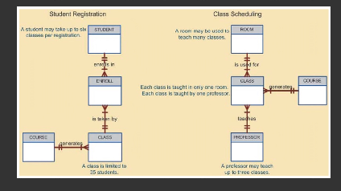

#### 3.0.3.1. 📊 ตารางเปรียบเทียบ Data Abstraction (ออกข้อสอบบ่อยมาก):
| ระดับ (Level) | ใครเป็นคนมอง? | ขึ้นกับ DBMS ไหม? (DBMS Independence) | ขึ้นกับ Hardware ไหม? (Hardware Independence) | ตัวอย่างสิ่งที่เห็น |
| :--- | :--- | :---: | :---: | :--- |
| **1. External** | End User / Programmer | ✅ อิสระ (ไม่ขึ้นกับ DBMS) | ✅ อิสระ (ไม่ขึ้นกับ HW) | หน้าจอ UI, รายงาน, View เฉพาะบุคคล |
| **2. Conceptual** | Database Designer | ✅ อิสระ (ไม่ขึ้นกับ DBMS) | ✅ อิสระ (ไม่ขึ้นกับ HW) | **ER Diagram** (Entity-Relationship) |
| **3. Internal** | DBA / Developer | ❌ **ขึ้นกับ DBMS** | ✅ อิสระ (ไม่ขึ้นกับ HW) | ตาราง Table Schema ใน MySQL/Oracle |
| **4. Physical** | Storage Engineer | ❌ **ขึ้นกับ DBMS** | ❌ **ขึ้นกับ Hardware** | Block size, B-Tree Index, การแบ่ง Partition ในดิสก์ |

---

# 4. Chapter 04: Relational Model Characteristics

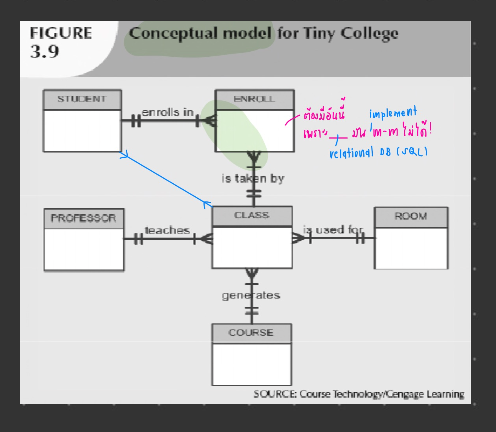

### 4.0.1. 3.1 ศัพท์พื้นฐานของ Relational Model
- **Relation (หรือ Table):** ตาราง 2 มิติ
- **Tuple (ทูเพิล หรือ Row):** แถวข้อมูล 1 แถว (= ข้อมูลของ Entity 1 ตัว)
- **Attribute (หรือ Column):** คอลัมน์ (= คุณลักษณะของ Entity)
- **Domain:** ขอบเขตของค่าที่ใส่ได้ในคอลัมน์นั้น เช่น `Age` ต้องเป็นเลขจำนวนเต็มบวก 1-120
- **Cardinality:** จำนวนแถว (Rows) ในตาราง
- **Degree:** จำนวนคอลัมน์ (Columns) ในตาราง

---

### 4.0.2. 3.2 เจาะลึกเรื่องคีย์ (Types of Keys) — 🎯 จุดจำง่าย

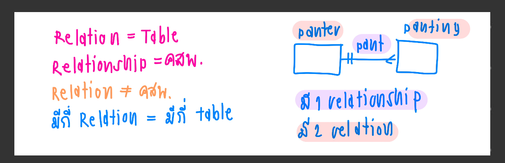
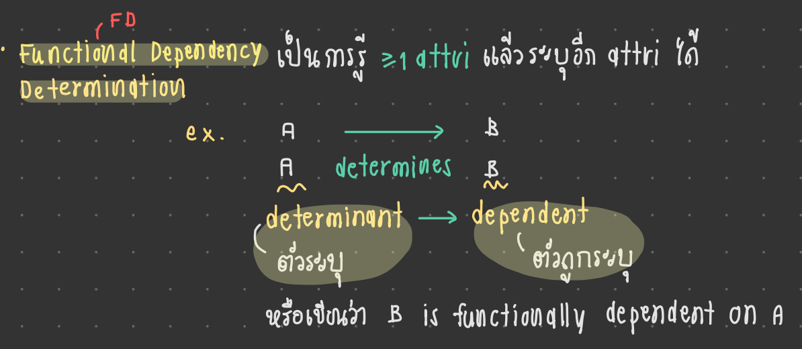

```
┌─────────────────────────────────────────────────────────────┐
│                       SUPERKEY                              │
│   (ชุด Attribute ใดๆ ที่ระบุแถวได้แบบไม่ซ้ำ เช่น ID, ID+Name)  │
│                                                             │
│      ┌───────────────────────────────────────────────┐      │
│      │               CANDIDATE KEY                   │      │
│      │   (Superkey ขนาดเล็กที่สุด ที่ไม่มีส่วนเกิน)     │      │
│      │                                               │      │
│      │      ┌─────────────────────────────────┐      │      │
│      │      │          PRIMARY KEY            │      │      │
│      │      │  (Candidate Key ที่เลือกมาใช้จริง) │      │      │
│      │      └─────────────────────────────────┘      │      │
│      └───────────────────────────────────────────────┘      │
└─────────────────────────────────────────────────────────────┘
```

1. **Superkey (ซูเปอร์คีย์):**
   - Attribute ตัวเดียวหรือหลายตัวรวมกัน ที่สามารถ **ระบุแถวในตารางได้ไม่ซ้ำกัน** (จะมีคอลัมน์ส่วนเกินติดมาด้วยก็ได้)
   - *ตัวอย่าง:* `{StudentID}`, `{StudentID, Name}`, `{StudentID, Phone, Address}` ทั้งหมดนี้เป็น Superkey
2. **Candidate Key (คีย์คู่แข่ง):**
   - คือ **Minimal Superkey** (Superkey ขั้นต่ำสุดที่ตัดคอลัมน์ส่วนเกินออกหมดแล้ว ถ้าตัดออกอีกตัวจะไม่สามารถระบุแถวได้)
   - *ตัวอย่าง:* `{StudentID}` และ `{CitizenID}` ต่างก็เป็น Candidate Key
3. **Primary Key (PK - คีย์หลัก):**
   - Candidate Key ที่ผู้ออกแบบ **เลือกมาเป็นตัวแทนหลัก** ของตาราง
   - **กฎเหล็ก:** ต้องไม่ซ้ำ (Unique) และ **ห้ามเป็นค่าว่าง (NOT NULL)** เด็ดขาด
4. **Foreign Key (FK - คีย์นอก):**
   - Attribute ในตารางหนึ่ง ที่ **ชี้ไปยัง Primary Key ของอีกตารางหนึ่ง** เพื่อสร้างความสัมพันธ์ระหว่างตาราง
5. **Composite Key (คีย์ผสม):**
   - คีย์ที่ประกอบด้วย Attribute ตั้งแต่ **2 คอลัมน์ขึ้นไปรวมกัน** จึงจะระบุแถวได้ เช่น `{CourseID, Semester}`
6. **Surrogate Key (คีย์ตัวแทน):**
   - คีย์ที่ระบบสร้างขึ้นมาใหม่แบบอัตโนมัติ (เช่น Auto-increment ID: 1, 2, 3...) มักใช้เมื่อข้อมูลจริงไม่มี Candidate Key ที่สั้นและเหมาะสม
7. **Secondary Key:**
   - คอลัมน์ที่ใช้เพื่อการสืบค้นข้อมูลเป็นหลัก (ไม่จำเป็นต้อง Unique) เช่น ค้นหาลูกค้าด้วย `LastName`

---

### 4.0.3. 3.3 กฎความถูกต้องสมบูรณ์ของข้อมูล (Integrity Rules)

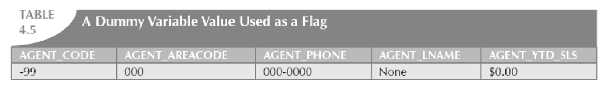

> ⚠️ **จุดแก้คำผิดจากสไลด์เดิม:**  
> ในสไลด์เดิมเขียนว่า *"กฎความไม่สมบูรณ์ของข้อมูล"* ซึ่งแปลผิด!  
> **ที่ถูกต้อง:** **"กฎความถูกต้องสมบูรณ์ของข้อมูล (Integrity Rules)"**

1. **Entity Integrity (ความถูกต้องของเอนทิตี):**
   - ทุกตารางต้องมี Primary Key
   - **Primary Key ต้องไม่ซ้ำ และต้องไม่เป็นค่า NULL เด็ดขาด!**
2. **Referential Integrity (ความถูกต้องของการอ้างอิง):**
   - ค่าของ Foreign Key จะต้อง **ตรงกับ Primary Key ในตารางแม่ที่มีอยู่จริง** หรือ **เป็นค่า NULL** เท่านั้น (ห้ามใส่ค่ามั่วที่ไม่มีในตารางแม่)

---

### 4.0.4. 3.4 พีชคณิตเชิงสัมพันธ์ (Relational Set Operators)

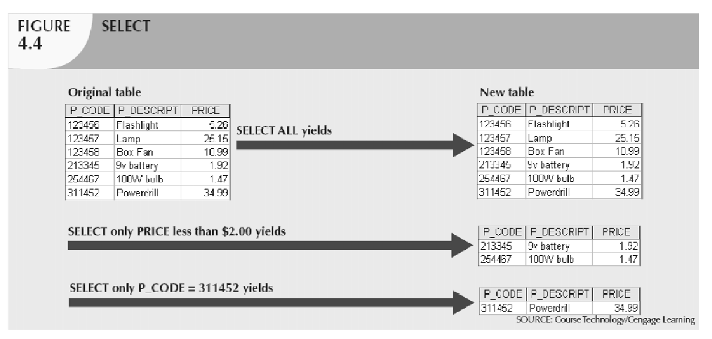
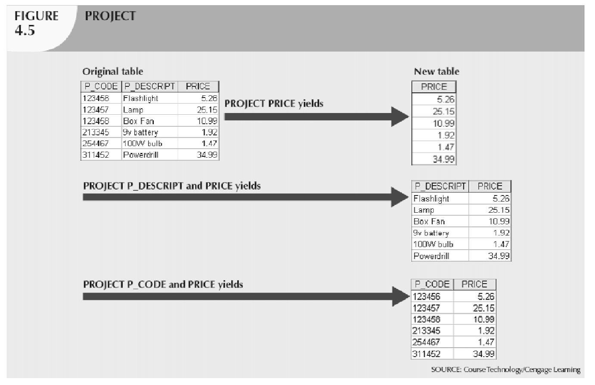

1. **Union ($\cup$):** รวมข้อมูลจาก 2 ตาราง (ตัดแถวที่ซ้ำกันออก) *ตารางต้องมีโครงสร้างเหมือนกัน (Union-Compatible)*
2. **Intersect ($\cap$):** เอาเฉพาะแถวที่มีอยู่ทั้งในตาราง A และตาราง B
3. **Difference ($-$/Except):** เอาแถวที่มีใน A แต่ไม่มีใน B ($A - B$)
4. **Cartesian Product ($\times$):** จับคู่ทุกแถวของ A กับทุกแถวของ B (ถ้า A มี 3 แถว, B มี 4 แถว ผลลัพธ์จะได้ $3 \times 4 = 12$ แถว)
5. **Select ($\sigma$):** กรองเอาเฉพาะ **"แถว (Rows)"** ที่ตรงตามเงื่อนไข (แนวนอน)
6. **Project ($\pi$):** เลือกเอาเฉพาะ **"คอลัมน์ (Columns)"** ที่ต้องการ (แนวตั้ง)
7. **Join ($\bowtie$):** รวมข้อมูลจาก 2 ตารางเข้าด้วยกันโดยจับคู่ผ่านคอลัมน์ที่เชื่อมโยงกัน (เช่น Natural Join, Equi-Join, Outer Join)

---

### 4.0.5. 3.5 Codd's 12 Rules (กฎ 12 ข้อของ E.F. Codd)

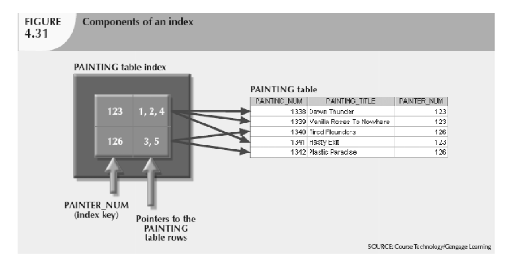

กฎที่ใช้เป็นเกณฑ์ตัดสินว่าฐานข้อมูลนั้นเป็น **True Relational Database** หรือไม่:
- **Rule 1: Information Rule** ข้อมูลทุกอย่างต้องเก็บในรูปตารางแถวและคอลัมน์ ค่าในเซลล์ต้องเป็นค่าเดี่ยว (Atomic)
- **Rule 2: Guaranteed Access Rule** ทุกข้อมูลต้องเข้าถึงได้ด้วยการระบุ (Table Name + Primary Key + Column Name)
- **Rule 3: Systematic Treatment of Null Values** มีระบบจัดการค่า Null อย่างเป็นมาตรฐาน (ไม่ใช่ช่องว่างหรือ 0)
- **Rule 4: Dynamic Online Catalog** Metadata ต้องเก็บเป็นตารางและค้นหาด้วย SQL ได้
- **Rule 5: Comprehensive Data Sublanguage** ต้องมีภาษาจัดการข้อมูลที่สมบูรณ์ (SQL) รองรับ DDL, DML, Transaction
- **Rule 6: View Updating Rule** View ที่สร้างขึ้น ต้องสามารถ Update ข้อมูลกลับไปยังตารางหลักได้
- **Rule 7: High-Level Insert, Update, Delete** รองรับคำสั่งจัดการข้อมูลทีละหลายแถว (Set-at-a-time)
- **Rule 8: Physical Data Independence** เปลี่ยนฮาร์ดแวร์/ดิสก์ ไม่กระทบต่อโปรแกรม
- **Rule 9: Logical Data Independence** เปลี่ยนโครงสร้างตาราง ไม่กระทบต่อโปรแกรมที่ไม่เกี่ยวข้อง
- **Rule 10: Integrity Independence** กฎ Integrity ต้องกำหนดไว้ใน Data Dictionary ไม่ใช่เขียนฮาร์ดโค้ดในแอปพลิเคชัน
- **Rule 11: Distribution Independence** ฐานข้อมูลจะกระจายกี่เซิร์ฟเวอร์ โปรแกรมก็ยังเรียกใช้งานเหมือนเดิม
- **Rule 12: Nonsubversion Rule** ห้ามมีช่องทางพิเศษ (Backdoor) เข้าไปแก้ข้อมูลโดยข้ามกฎ Integrity ของระบบ

---

# 5. Chapter 09: Normalizing Database Designs

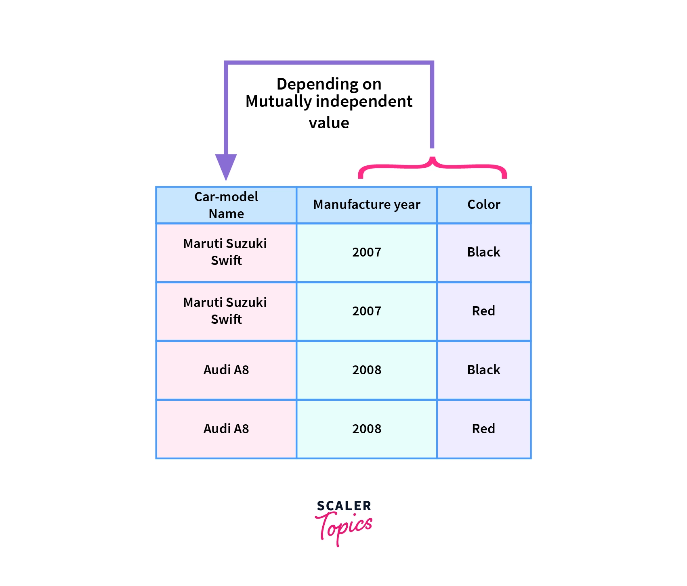

**Normalization คืออะไร?**  
คือกระบวนการ **"จัดระเบียบโครงสร้างตาราง"** เพื่อ:
1. **ลดความซ้ำซ้อนของข้อมูล (Data Redundancy)**
2. **ขจัดปัญหาความผิดปกติ (Data Anomalies: Insert, Update, Delete Anomalies)**
3. ทำให้การขยายฐานข้อมูลในอนาคตทำได้ง่ายและปลอดภัย

---

### 5.0.1. 4.1 ความสัมพันธ์ฟังก์ชัน (Functional Dependency: FD)
สัญลักษณ์: $A \rightarrow B$ (อ่านว่า $A$ กำหนด $B$ หรือ $B$ ขึ้นอยู่กับ $A$)  
- $A$ เรียกว่า **Determinant (ตัวกำหนด)**
- $B$ เรียกว่า **Dependent (ตัวถูกกำหนด)**

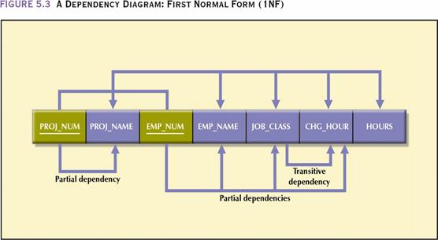
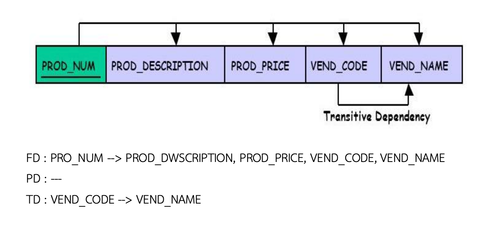

#### 5.0.1.1. 🎯 ชนิดของ Functional Dependency (ต้องแม่น!):
1. **Full Functional Dependency (ขึ้นต่อกันอย่างสมบูรณ์):**
   - $B$ ขึ้นอยู่กับ Primary Key **ทุกตัวรวมกัน** ไม่สามารถตัดคีย์ตัวใดตัวหนึ่งออกได้
   - *เช่น:* `{StudentID, CourseID} -> Grade` (ต้องรู้ทั้งรหัสนักศึกษาและรหัสวิชา ถึงจะรู้เกรด)
2. **Partial Dependency (ขึ้นต่อกันเพียงบางส่วน):**
   - $B$ ดันไปขึ้นอยู่กับ **แค่บางส่วนของ Composite Primary Key**
   - *เช่น:* `{StudentID, CourseID} -> StudentName` (แค่รู้ `StudentID` ตัวเดียวก็รู้ชื่อแล้ว ไม่จำเป็นต้องมี `CourseID`)
3. **Transitive Dependency (ขึ้นต่อกันแบบทอดต่อ/ส่งต่อ):**
   - Non-Key ตัวหนึ่ง ดันไปกำหนด Non-Key อีกตัวหนึ่ง ($X \rightarrow Y \rightarrow Z$)
   - *เช่น:* `StudentID -> DeptID` และ `DeptID -> DeptName` (รู้รหัสภาควิชา เลยรู้ชื่อภาควิชา ทั้งที่ทั้งคู่ไม่ใช่ Primary Key)
4. **Multivalued Dependency ($A \twoheadrightarrow B$):**
   - 1 คีย์ มีความสัมพันธ์กับกลุ่มของค่าหลายค่าที่เป็นอิสระต่อกัน (ทำให้เกิดข้อมูลแบบ M:N ซ้ำๆ ในตาราง)

---

### 5.0.2. 4.2 ขั้นตอนการทำ Normalization (1NF $\rightarrow$ 2NF $\rightarrow$ 3NF $\rightarrow$ BCNF $\rightarrow$ 4NF)

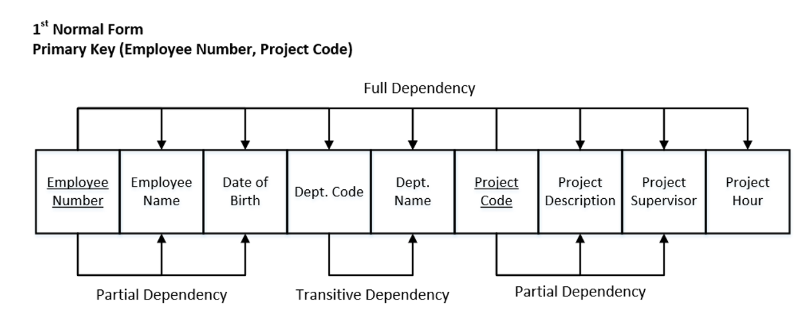

#### 5.0.2.1. 1️⃣ First Normal Form (1NF)
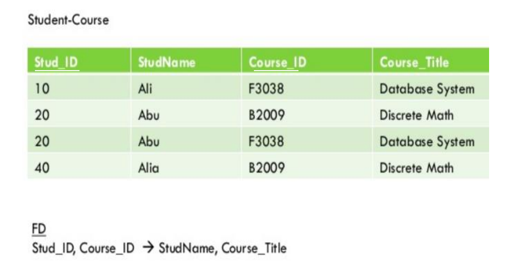
- **เงื่อนไข:**
  1. ทุกช่อง (Cell) ต้องมี **ค่าเดี่ยว (Atomic value)**
  2. **ไม่มีกลุ่มข้อมูลซ้ำ (No Repeating Groups)** (ห้ามมีช่องว่าง หรือ 1 ช่องมีหลายค่าคั่นด้วย comma)
  3. ต้อง **กำหนด Primary Key**
- **วิธีแก้:** เติมข้อมูลในช่องว่างให้เต็มทุกแถว และกำหนด Composite PK

---

#### 5.0.2.2. 2️⃣ Second Normal Form (2NF)
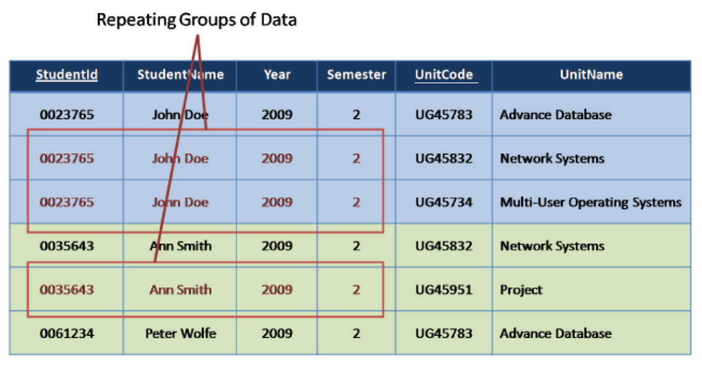
- **เงื่อนไข:**
  1. ต้องเป็น **1NF** มาก่อน
  2. **ต้องไม่มี Partial Dependency** (ไม่มีคอลัมน์ใดที่ขึ้นกับ PK แค่บางตัว)
  *(หมายเหตุ: ถ้าตารางใน 1NF มี Primary Key เป็นคอลัมน์เดี่ยวอยู่แล้ว ตารางนั้นจะผ่าน 2NF โดยอัตโนมัติ!)*
- **วิธีแก้:** **แตกตาราง** แยกส่วนที่มี Partial Dependency ออกไปเป็นตารางใหม่ โดยเอาส่วนของ PK ที่มันขึ้นตรงด้วยไปเป็น Primary Key ของตารางใหม่

---

#### 5.0.2.3. 3️⃣ Third Normal Form (3NF)
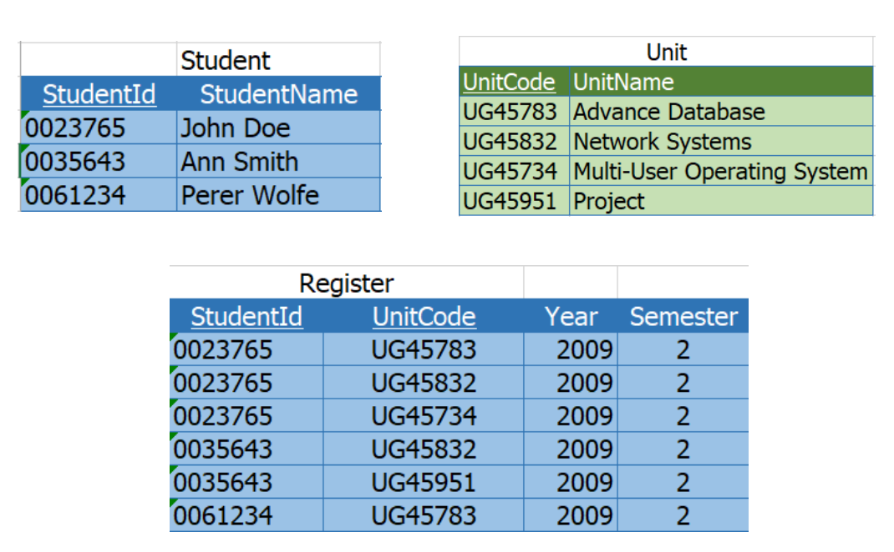

- **เงื่อนไข:**
  1. ต้องเป็น **2NF** มาก่อน
  2. **ต้องไม่มี Transitive Dependency** (Non-Key ห้ามไปกำหนดค่า Non-Key ด้วยกันเอง)
- **วิธีแก้:** **แตกตาราง** ดึงคู่ที่เป็น Transitive Dependency ออกไปเป็นตารางใหม่ โดยให้ตัวกำหนด (Determinant) เป็น PK ในตารางใหม่ และยังคงเป็น Foreign Key อยู่ในตารางเดิม

---

#### 5.0.2.4. 4️⃣ Boyce-Codd Normal Form (BCNF)
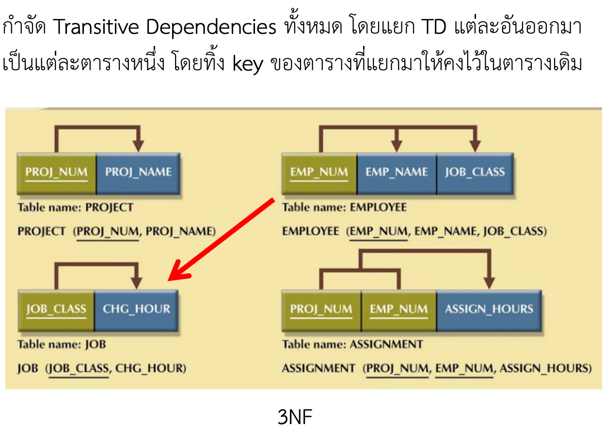
- **เงื่อนไข:**
  1. ต้องเป็น **3NF** มาก่อน
  2. **ทุกตัวกำหนด (Determinant) จะต้องเป็น Candidate Key (Superkey) เท่านั้น!**
  *(เกิดขึ้นเมื่อตารางมี Candidate Key หลายตัวที่ซ้อนทับกัน หรือ Non-Key ดันไปกำหนดส่วนหนึ่งของ Candidate Key)*
- **วิธีแก้:** แตกตาราง โดยแยกตัวกำหนด (Determinant) และตัวที่มันควบคุมออกไปเป็นตารางใหม่

---

#### 5.0.2.5. 5️⃣ Fourth Normal Form (4NF)
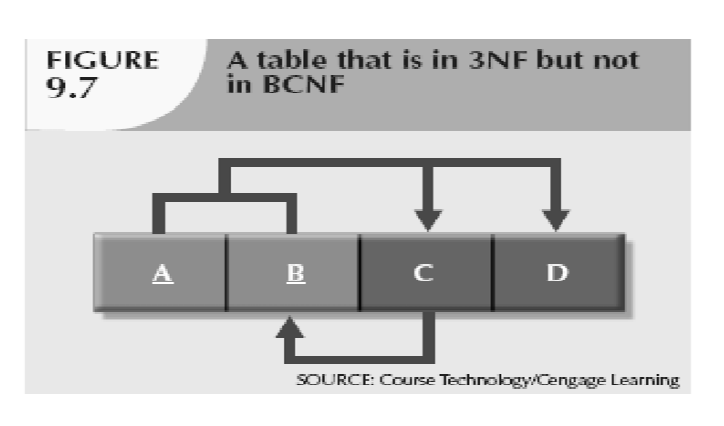
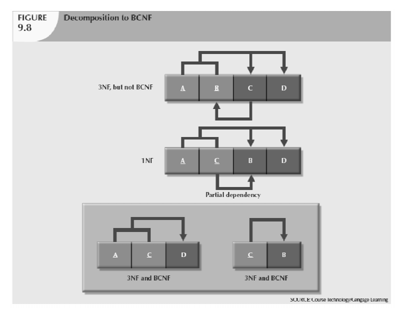
- **เงื่อนไข:**
  1. ต้องเป็น **BCNF** มาก่อน
  2. **ต้องไม่มี Multivalued Dependency ($A \twoheadrightarrow B$)** ที่เป็นอิสระต่อกันในตารางเดียวกัน
- **วิธีแก้:** แตกตารางออกเป็น 2 ตารางย่อย แยกความสัมพันธ์ Many-to-Many ออกจากกันอย่างเด็ดขาด

---

### 5.0.3. 4.3 Denormalization (การลดระดับ Normalization)
- **ทำไมถึงต้องทำ?**  
  การ Normalize ระดับสูง (3NF/BCNF) ทำให้ต้อง **แตกเป็นหลายสิบตาราง** เวลาจะดึงข้อมูลต้องเขียนคำสั่ง `JOIN` ข้ามตารางจำนวนมาก ทำให้ **ระบบทำงานช้าลง (Performance ลดลง)**
- **Denormalization** คือการจงใจยอมให้มีข้อมูลซ้ำซ้อนบางส่วนเพื่อ **ลดจำนวนการ JOIN และเพิ่มความเร็วในการ Query** (มักใช้ในระบบ Data Warehouse / Reporting)

---

# 6. 📌 สรุปสูตรลัดและจุดที่ข้อสอบชอบหลอก

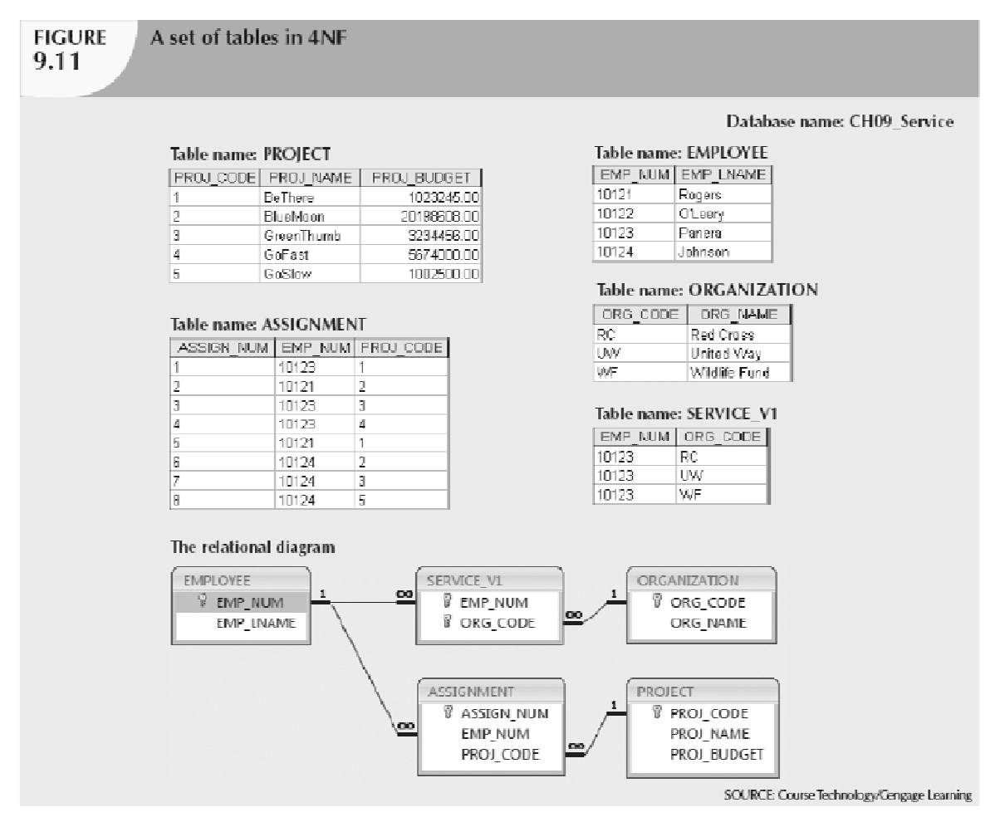

### 6.0.1. ⚡ Checklist ตรวจสอบระดับ Normal Form ใน 5 วินาที:
```
1NF : ไม่มีช่องว่าง ไม่มีค่าหลายตัวในเซลล์เดียว (Atomic) + มี PK
      ↓ (กำจัด Partial Dependency)
2NF : ไม่มีคอลัมน์ไหนขึ้นกับ PK แค่ครึ่งเดียว (ถ้า PK เป็นคอลัมน์เดี่ยว ผ่าน 2NF ทันที!)
      ↓ (กำจัด Transitive Dependency)
3NF : Non-Key ห้ามชี้ Non-Key ด้วยกันเอง
      ↓ (เข้มงวดยิ่งขึ้น)
BCNF: ตัวกำหนด (ฝั่งซ้ายของลูกศร FD) ทุกตัวต้องเป็น Candidate Key
      ↓ (กำจัด Multivalued Dependency)
4NF : ไม่มี 1:M สองชุดที่เป็นอิสระต่อกันยัดอยู่ในตารางเดียว
```

### 6.0.2. 🚨 5 จุดที่ข้อสอบชอบเอามาหลอก:
1. **Data vs Information:** จำไว้ว่า `24` = Data, `"24 องศาเซลเซียส"` = Information
2. **Superkey vs Candidate Key:** Superkey มีของแถมได้ (ไม่ Minimal) ส่วน Candidate Key ห้ามมีของแถม (Minimal)
3. **Entity Integrity vs Referential Integrity:**
   - Entity Integrity $\rightarrow$ ตรวจ **Primary Key** (ห้าม NULL, ห้ามซ้ำ)
   - Referential Integrity $\rightarrow$ ตรวจ **Foreign Key** (ต้องตรงกับแม่ หรือเป็น NULL)
4. **ANSI/SPARC 4 Levels:** ระดับ **Conceptual** ไม่ขึ้นกับทั้ง DBMS และ Hardware แต่ระดับ **Internal** ขึ้นกับ DBMS
5. **Relational Operators:** **Select ($\sigma$)** ตัดแถวแนวนอน, **Project ($\pi$)** ตัดคอลัมน์แนวตั้ง
